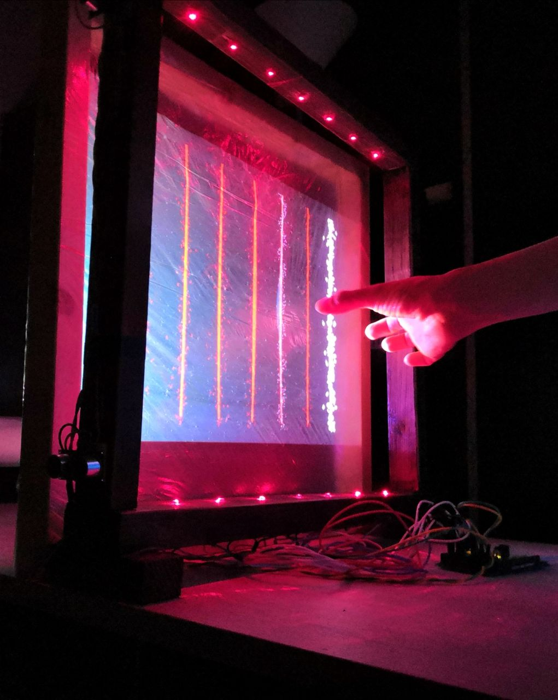
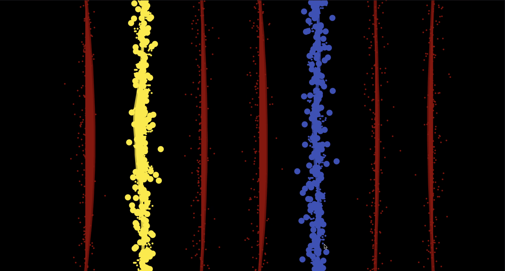

Not an Harp is our take on an acoustic harp.

NaH is a music computer system based on a regular harp. 
NaH doesn't have any strings, so forget about spending money on strings and wasting time to change them: now the strings are lasers. 

Basically it's a midi instrument, so you can use it in your daw of choice and load any virtual instrument you like. But remember it's an harp so it shuold sound like one (just kidding).

It has 7 lasers, or string if you prefer, so it goes from C to B.
It has an integrated pitch bend control.
It's polyphonic so you can play chords. 
When playing single notes you can go slowly or very fast. 
The default sound is plucked strings. 

There is also an effect, tremolo. 
You can control the speed of the tremolo with the palm of your hand, through a sensor just like the pitchbend. 

If you want some visual feedback just run the ".pde" file to visualize the strings and the related effects. 

Guide: 

Run the Arduino file 
Run the SuperCollider file
Run the .pde file for some visual feedback. 

 # Group members:
- Juan Camilo Albarracín Sánchez
- Michele Murciano
- Emanuele Pavese
- Camilo Trujillo Gutiérrez
- Francesco Zese
